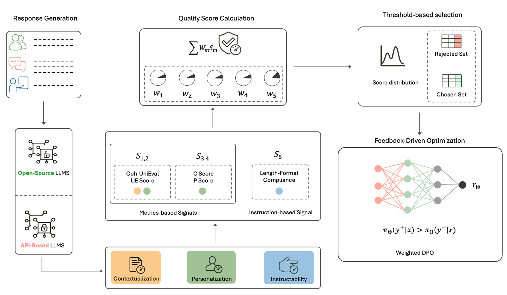
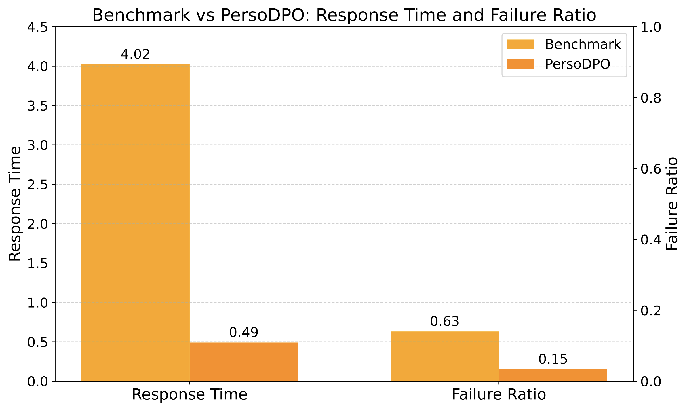
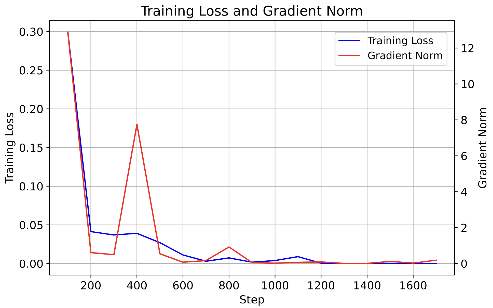
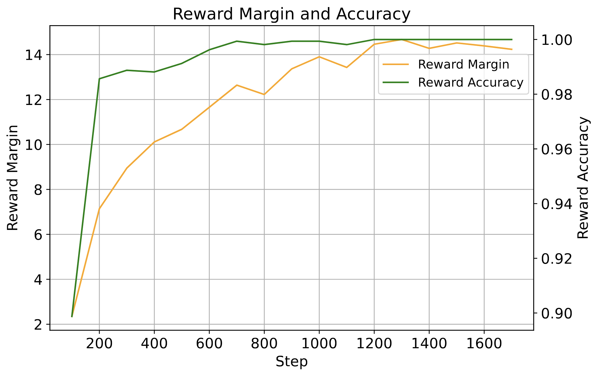

# PersoDPO
### Scalable Preference Optimization for Instruction-Adherent, Persona-Grounded Dialogue via Multi-LLM Evaluation


## Abstract
Personalization and contextual coherence are two essential components in building effective persona-grounded dialogue systems. These aspects play a crucial role in enhancing user engagement and ensuring responses are more relevant and consistent with user identity. However, recent studies indicate that open-source large language models (LLMs) continue to struggle to generate responses that are both contextually grounded and aligned with persona cues, despite exhibiting strong general conversational abilities like fluency and naturalness. We present PersoDPO, a scalable preference optimisation framework that uses supervision signals from automatic evaluations of responses generated by both closed-source and open-source LLMs to fine-tune dialogue models. The framework integrates evaluation metrics targeting coherence and personalization, along with a length-format compliance feature to promote instruction adherence. These signals are combined to automatically construct high-quality preference pairs without manual annotation, enabling a scalable and reproducible training pipeline. Experiments on the FoCus dataset show that an open-source language model fine-tuned with the PersoDPO framework consistently outperforms strong open-source baselines and a standard Direct Preference Optimization (DPO) variant across multiple evaluation dimensions.

## Figures

|  | 
|:----------------------------------------------------------:|
| Fig.1 - PersoDPO framework overview.|

<div align="center" style="margin: 30px 0;">

<table>
  <tr>
    <td align="center">
      <br/>
      (a)
    </td>
    <td align="center">
      <br/>
      (b)
    </td>
    <td align="center">
      <br/>
      (c)
    </td>
  </tr>
</table>

<br/>

 Fig.2 - Comparison of (a) response time and failure ratio
  (b) loss gradnorm and (c) margin-augmented accuracy.

</div>


## 🚀 Quick Start

1. Clone the relevant repositories:
   ```bash
   git clone https://github.com/salehafzoon/PersoDPO

